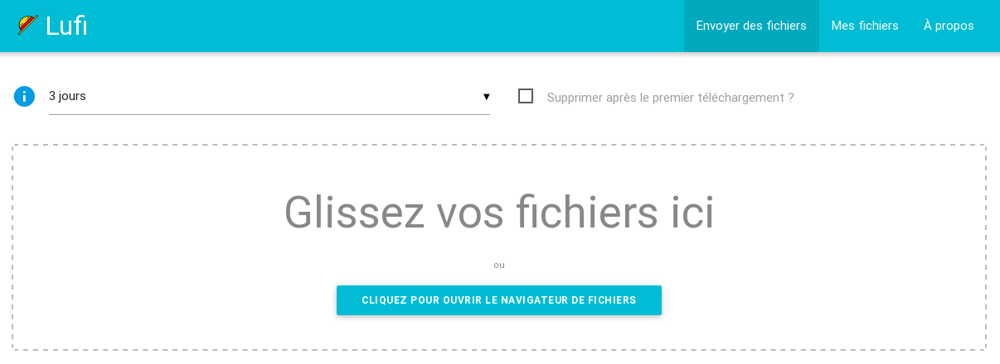

<!--
Nota bene : ce README est automatiquement généré par <https://github.com/YunoHost/apps/tree/master/tools/readme_generator>
Il NE doit PAS être modifié à la main.
-->

# Lufi pour YunoHost

[](https://dash.yunohost.org/appci/app/lufi)  

[](https://install-app.yunohost.org/?app=lufi)

*[Lire le README dans d'autres langues.](./ALL_README.md)*

> *Ce package vous permet d’installer Lufi rapidement et simplement sur un serveur YunoHost.*  
> *Si vous n’avez pas YunoHost, consultez [ce guide](https://yunohost.org/install) pour savoir comment l’installer et en profiter.*

## Vue d’ensemble

Lufi stores files and allows you to download them. Is that all? No. All the files are encrypted **by the browser**! It means that your files **never** leave your computer unencrypted.
The administrator of the Lufi instance you use will not be able to see what is in your file, neither will your network administrator, or your ISP.
The encryption key part of the URL is a anchor (Cf. [Fragment Identifier](https://en.wikipedia.org/wiki/Fragment_identifier)), that means this part is only processed client-side and does not reach the server. :-)


**Version incluse :** 0.07.0~ynh1

**Démo :** <https://demo.lufi.io/>

## Captures d’écran



## Documentations et ressources

- Site officiel de l’app : <https://git.framasoft.org/luc/lufi>
- Documentation officielle de l’admin : <https://framagit.org/luc/lufi/wikis/home>
- Dépôt de code officiel de l’app : <https://framagit.org/fiat-tux/hat-softwares/lufi>
- YunoHost Store : <https://apps.yunohost.org/app/lufi>
- Signaler un bug : <https://github.com/YunoHost-Apps/lufi_ynh/issues>

## Informations pour les développeurs

Merci de faire vos pull request sur la [branche `testing`](https://github.com/YunoHost-Apps/lufi_ynh/tree/testing).

Pour essayer la branche `testing`, procédez comme suit :

```bash
sudo yunohost app install https://github.com/YunoHost-Apps/lufi_ynh/tree/testing --debug
ou
sudo yunohost app upgrade lufi -u https://github.com/YunoHost-Apps/lufi_ynh/tree/testing --debug
```

**Plus d’infos sur le packaging d’applications :** <https://yunohost.org/packaging_apps>
