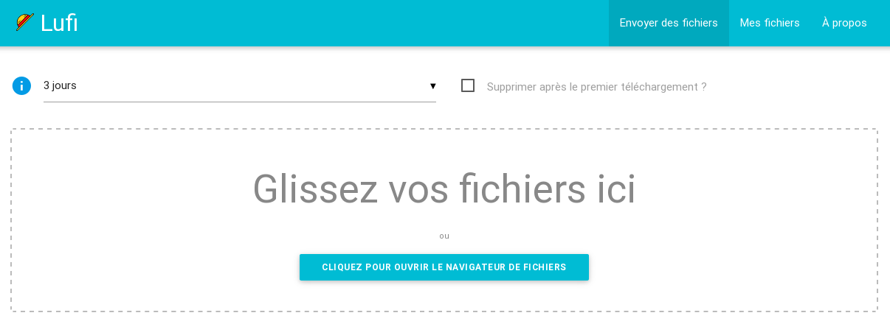

<!--
To README zostało automatycznie wygenerowane przez <https://github.com/YunoHost/apps/tree/master/tools/readme_generator>
Nie powinno być ono edytowane ręcznie.
-->

# Lufi dla YunoHost

[](https://ci-apps.yunohost.org/ci/apps/lufi/)


[](https://install-app.yunohost.org/?app=lufi)

*[Przeczytaj plik README w innym języku.](./ALL_README.md)*

> *Ta aplikacja pozwala na szybką i prostą instalację Lufi na serwerze YunoHost.*  
> *Jeżeli nie masz YunoHost zapoznaj się z [poradnikiem](https://yunohost.org/install) instalacji.*

## Przegląd

Lufi stores files and allows you to download them. Is that all? No. All the files are encrypted **by the browser**! It means that your files **never** leave your computer unencrypted.
The administrator of the Lufi instance you use will not be able to see what is in your file, neither will your network administrator, or your ISP.
The encryption key part of the URL is a anchor (Cf. [Fragment Identifier](https://en.wikipedia.org/wiki/Fragment_identifier)), that means this part is only processed client-side and does not reach the server. :-)


**Dostarczona wersja:** 0.07.0~ynh1

**Demo:** <https://demo.lufi.io/>

## Zrzuty ekranu



## Dokumentacja i zasoby

- Oficjalna strona aplikacji: <https://git.framasoft.org/luc/lufi>
- Oficjalna dokumentacja dla administratora: <https://framagit.org/luc/lufi/wikis/home>
- Repozytorium z kodem źródłowym: <https://framagit.org/fiat-tux/hat-softwares/lufi>
- Sklep YunoHost: <https://apps.yunohost.org/app/lufi>
- Zgłaszanie błędów: <https://github.com/YunoHost-Apps/lufi_ynh/issues>

## Informacje od twórców

Wyślij swój pull request do [gałęzi `testing`](https://github.com/YunoHost-Apps/lufi_ynh/tree/testing).

Aby wypróbować gałąź `testing` postępuj zgodnie z instrukcjami:

```bash
sudo yunohost app install https://github.com/YunoHost-Apps/lufi_ynh/tree/testing --debug
lub
sudo yunohost app upgrade lufi -u https://github.com/YunoHost-Apps/lufi_ynh/tree/testing --debug
```

**Więcej informacji o tworzeniu paczek aplikacji:** <https://yunohost.org/packaging_apps>
